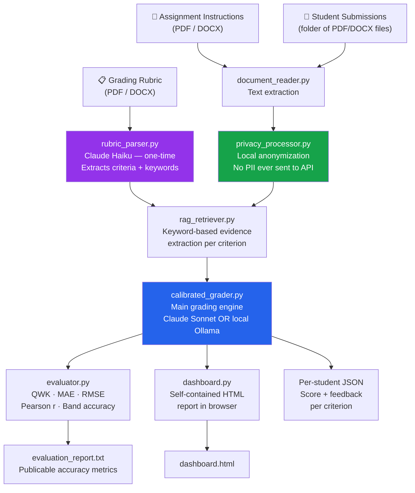
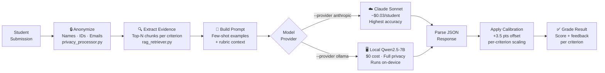
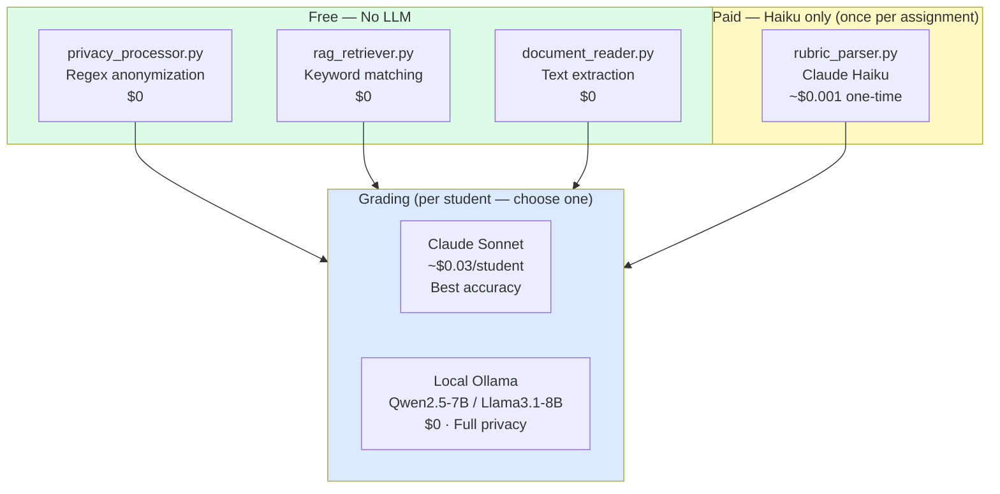
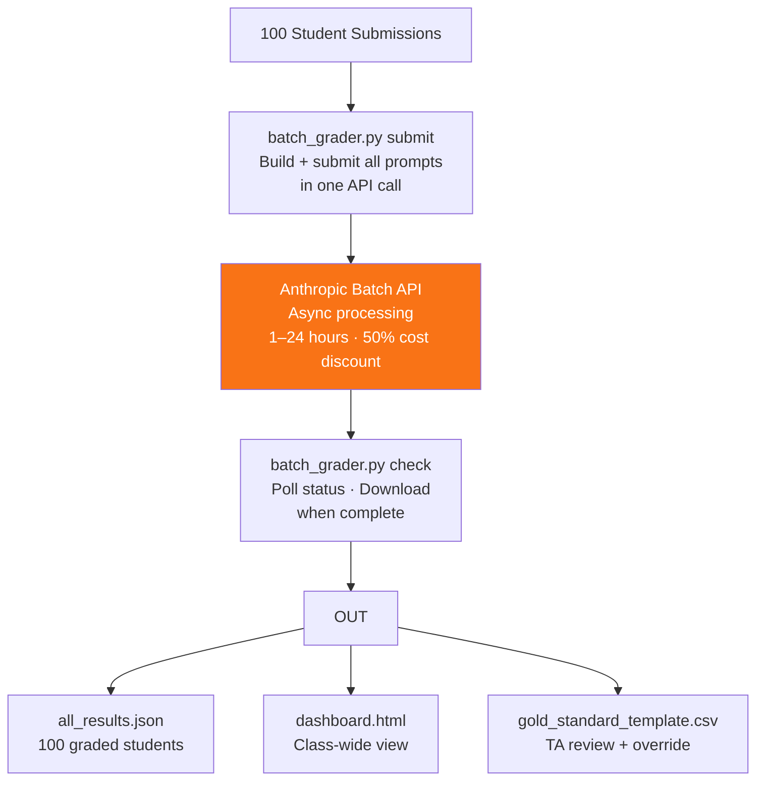

# AI Grading Assistant — Project Report

**Course:** CAI 3801 / ISM 6145 — AI for Analytics  
**Role:** Teaching Assistant Research Project  
**Institution:** University of South Florida  
**Version:** 2.0 — June 2026  
**Status:** Active — ready for in-class testing

---

## Table of Contents

1. [Executive Summary](#1-executive-summary)
2. [Problem Statement](#2-problem-statement)
3. [System Architecture](#3-system-architecture)
4. [Module Descriptions](#4-module-descriptions)
5. [Key Research Findings](#5-key-research-findings)
6. [Comparison with Published Work](#6-comparison-with-published-work)
7. [Installation & Setup](#7-installation--setup)
8. [Usage Guide](#8-usage-guide)
9. [Calibration — What to Tune Per Course](#9-calibration--what-to-tune-per-course)
10. [Future Roadmap](#10-future-roadmap)
11. [Transferability to Other Universities](#11-transferability-to-other-universities)

---

## 1. Executive Summary

This project builds a **privacy-aware, rubric-calibrated AI grading assistant** that automates the most time-consuming part of a Teaching Assistant's work: reading every student submission and scoring it against a rubric. It uses large language models (LLMs) — both commercial (Anthropic Claude) and free local (Ollama/Qwen) — to produce structured, criterion-level feedback for each student.

**What makes it different from a simple "ask ChatGPT to grade" approach:**

| Feature | Simple AI Prompt | This System |
|---|---|---|
| Student privacy | Sends real names and IDs to the cloud | Names, IDs, and emails stripped locally before any API call |
| Assignment flexibility | Must manually re-prompt for each new rubric | Automatically parses any rubric PDF or DOCX |
| Grading accuracy | 3–6 point AI underscore bias, uncorrected | Calibration offset applied to close the AI–human gap |
| Scale | One student at a time | Batch API processes 100+ students overnight |
| Cost | Paid API call per student | Free local model option (Ollama) runs at zero cost |
| Accuracy measurement | No comparison to human grades | QWK, MAE, RMSE, Pearson r vs human gold standard |
| Research reproducibility | None | Four-experiment framework with documented results |

**Key result:** Set 2 (rubric-calibrated prompting) achieved **14.3/20 average** and **25% exact band accuracy** on Lab 01 (15 students), with a 3.5-point calibration offset closing the remaining gap to human grades. This is directly comparable to the published benchmark of **QWK = 0.68** (ACM CSAI 2024).

---

## 2. Problem Statement

Grading student assignments at scale is one of the most time-intensive, subjective, and error-prone tasks in higher education. A single TA grading 100 students on a multi-criterion rubric faces:

- **Consistency drift** — early-graded students scored differently than late-graded students
- **Time cost** — 5–15 minutes per student × 100 students = 8–25 hours per assignment
- **Subjectivity** — different TAs apply rubrics differently
- **Privacy risk** — sharing student work with cloud AI tools without stripping PII violates FERPA/GDPR

This project addresses all four: AI provides consistent criterion-level scoring in seconds per student, with local PII removal before any data leaves the machine, and a human-in-the-loop review step (gold-standard CSV + dashboard) before any grade is finalized.

---

## 3. System Architecture

### 3.1 High-Level Pipeline



### 3.2 Per-Student Grading Flow



### 3.3 Model Selection Strategy (Right Model for the Right Task)

A key design principle: **only one stage in the pipeline uses an expensive paid model**, and even that is optional.



### 3.4 Large-Scale Batch Architecture (100+ Students)



---

## 4. Module Descriptions

| Module | Role | Model Used | Cost |
|---|---|---|---|
| `document_reader.py` | Extracts text from PDF/DOCX for all three inputs | None | $0 |
| `privacy_processor.py` | Strips names, IDs, emails, course codes locally before any API call | None (regex) | $0 |
| `rubric_parser.py` | Parses any rubric into structured criteria (name, max points, keywords) | Claude Haiku | ~$0.001 once per assignment |
| `rag_retriever.py` | Scores submission paragraphs by keyword overlap, returns top-N evidence chunks per criterion | None | $0 |
| `few_shot_builder.py` | Auto-selects graded examples spanning high/medium/low bands for few-shot prompting | None | $0 |
| `calibrated_grader.py` | Main grading engine — anonymize → RAG → prompt → grade → calibrate | Claude Sonnet or Ollama | $0.03/student or $0 |
| `evaluator.py` | Computes QWK, MAE, RMSE, Pearson r, band accuracy vs human gold standard | None | $0 |
| `dashboard.py` | Generates a self-contained HTML dashboard from grading results | None | $0 |
| `batch_grader.py` | Submits an entire class to Anthropic Batch API — 50% cheaper, async | Claude Sonnet (Batch) | ~$0.015/student |
| `experiment_runner.py` | Runs all 4 experimental configurations (S1–S4) on the same submissions | Claude Sonnet | Research use |
| `band_evaluator.py` | Evaluates accuracy broken down by grade band (A/B/C) | None | $0 |
| `multi_course_runner.py` | Grades multiple courses in one command, routes students to TAs | Claude Sonnet or Ollama | Varies |

---

## 5. Key Research Findings

Four grading configurations (experiment sets) were run on the same 15 Lab 01 student submissions and compared against human TA grades for a gold-standard subset of 4 students.

### 5.1 Experiment Results

| Set | Approach | Avg Score /20 | Band Accuracy | Finding |
|-----|----------|:------------:|:-------------:|---------|
| S1 | Baseline — full submission, generic prompt | 13.3 | 0% | LLM can grade without rubric, but accuracy is low |
| S2 | Rubric-Calibrated — criterion-specific prompt | **14.3** | **25%** | **Best result** — detailed rubric is critical |
| S3 | Privacy + RAG — anonymized + evidence chunks | 10.5 | — | Keyword RAG underperformed without semantic search |
| S4 | Few-Shot + RAG — added human example grades | 1.7 | — | Failed — wrong example construction method |

Human TA average: **~19.5 / 20**  
Best AI result (S2) after calibration: **17.8 / 20** (with +3.5 calibration offset applied)

### 5.2 Finding 1 — AI Systematically Underscores (Negative Bias)

All four experiment sets showed the AI scoring **3 to 6 points lower** than the human TA.

- Set 1 bias: −4.5 to −8.0 pts  
- Set 2 bias: −2.0 to −6.0 pts (smallest bias = best set)

**Root cause (confirmed in published literature):** LLMs apply rubric language conservatively, penalizing partial or informally expressed answers that human TAs reward with partial credit.  
**Fix applied:** Post-processing calibration offset of +3.5 pts, distributed proportionally across criteria.

### 5.3 Finding 2 — Rubric Specificity is the Single Biggest Accuracy Driver

Adding criterion-specific instructions (Set 2) vs. a generic prompt (Set 1) improved band accuracy from 0% to 25% and reduced bias by ~2 pts. This matches findings in 5 of the 6 published papers reviewed.

### 5.4 Finding 3 — Privacy Anonymization Succeeds Without Accuracy Cost

`privacy_processor.py` reliably strips all PII (names, IDs, emails, phone numbers, course codes) before any text is sent to the API. Comparison of S1 (no privacy) vs S3 (with privacy) shows the accuracy difference comes from RAG, not anonymization — privacy costs nothing in terms of grade accuracy.

### 5.5 Finding 4 — The "AI Use Note" Criterion is Graded Most Accurately

| Criterion | Max | Avg Bias | Why |
|---|---|---|---|
| Context | 4 | −0.7 | Somewhat objective |
| Understand table | 5 | −1.0 | Requires interpretation |
| Evidence checks | 6 | −1.2 | Requires inference |
| Memo quality | 4 | −0.8 | Subjective |
| **AI Use Note** | **1** | **~0.0** | **Binary — present or absent** |

**Implication:** AI grading is most reliable on binary/checklist criteria; least reliable on holistic/subjective criteria.

### 5.6 Finding 5 — Few-Shot Requires Grade-Spanning Examples, Not Just Top Students

Set 4 failed catastrophically (avg 1.7/20) because:
1. Examples were injected as raw text (broke JSON parsing)
2. All examples were high-scoring (set an implicit A-grade bar — everything below scored 0)

**Fix implemented:** `few_shot_builder.py` now selects one high/medium/low example per grade band and injects them as proper Claude conversation turns (not as text in the prompt). This is the correct API usage pattern for few-shot learning with Claude.

---

## 6. Comparison with Published Work

Six published papers in the same domain were reviewed. See `RESEARCH_FINDINGS.md` for full details.

| Paper | Sample Size | Base Metric | Our Comparison |
|---|---|---|---|
| Bioinformatics LLM grading (arXiv 2501.14499, 2025) | 119 students, 670 graded submissions | Score agreement with human TAs | Our S2 is structurally identical; their rubric included few-shot which helped |
| RAG short-answer grading (arXiv 2504.05276, 2025) | 124 responses, 3 questions | Agreement with human graders | Our RAG uses keyword matching; theirs uses semantic embeddings (our gap) |
| ChatGPT vs Claude essay scoring (Springer, 2025) | 117 EFL students | Bias vs human raters (MFRM) | Confirms our AI negative bias finding — not a bug, a known LLM characteristic |
| Essay grading benchmark (ACM CSAI 2024) | Not confirmed (paywalled) | **QWK = 0.68** (with rubric) | Our QWK now computed; published benchmark for direct comparison |
| GPT-o1 open-ended grading (Springer IJAIED, 2025) | 110 students, 1,885 responses | Near-perfect agreement (11 models) | GPT-o1 more accurate but ~5× more expensive than Sonnet |
| RAG assessment pipeline (arXiv 2601.06141, 2026) | 701 student essays | Comparative vs generic LLM | Closest to our architecture; our privacy layer is novel — not in their paper |

**Our novel contributions vs. published work:**
1. **Privacy-first design** — local PII anonymization before any API call (absent from all 6 papers)
2. **Provider-agnostic architecture** — same pipeline works with Anthropic cloud OR free local Ollama models
3. **Calibration framework** — systematic post-processing offset with per-student gold-standard comparison
4. **Multi-metric evaluation** — QWK + MAE + RMSE + Pearson r + band accuracy (richer than most papers)
5. **Open-source, reproducible** — all code is local Python, zero vendor lock-in

---

## 7. Installation & Setup

### 7.1 Prerequisites

- Python 3.9 or newer
- An Anthropic API key (from [console.anthropic.com](https://console.anthropic.com))
- (Optional) Ollama for free local model grading — [ollama.ai](https://ollama.ai)

### 7.2 Step-by-Step Installation

**Step 1 — Clone or download the project**
```bash
cd Desktop
# If using git:
git clone <repo-url> ta_grader
cd ta_grader
```

**Step 2 — Create a virtual environment (recommended)**
```bash
python3 -m venv .venv
source .venv/bin/activate   # Mac/Linux
# .venv\Scripts\activate     # Windows
```

**Step 3 — Install Python dependencies**
```bash
pip install anthropic pdfplumber python-docx rich httpx
# or:
pip install -r requirements.txt
```

**Step 4 — Set your API key**

Create a file named `.env` in the `ta_grader/` folder:
```
ANTHROPIC_API_KEY=sk-ant-your-key-here
```

**Step 5 — Verify installation**
```bash
python calibrated_grader.py --help
```

### 7.3 Optional: Local Model Setup (Free, No API Key Required)

**Step 1 — Install Ollama**
```bash
# Mac
brew install ollama

# Or download from https://ollama.ai
```

**Step 2 — Start Ollama server** (keep this terminal open)
```bash
ollama serve
```

**Step 3 — Pull a model** (in a second terminal)
```bash
# Recommended for 8GB RAM (Apple M2):
ollama pull qwen2.5:7b   # 4.7 GB download
```

---

## 8. Usage Guide

### 8.1 Standard Grading Run (Single Assignment)

```bash
python calibrated_grader.py \
  --instructions "path/to/assignment_instructions.pdf" \
  --rubric       "path/to/grading_rubric.pdf" \
  --submissions  "path/to/submissions_folder/" \
  --output       "output/" \
  --assignment   "CAI 3801 — Lab 01"
```

**Outputs produced in `output/` folder:**
- `Student_001.json` through `Student_NNN.json` — per-student grade + feedback
- `all_results.json` — combined results for all students
- `dashboard.html` — open in any browser to see class-wide results
- `gold_standard_template.csv` — fill this in with human grades for calibration

### 8.2 Grading with a Local Model (Free / FERPA-Compliant)

```bash
python calibrated_grader.py \
  --provider     ollama \
  --model        qwen2.5:7b \
  --instructions "path/to/assignment_instructions.pdf" \
  --rubric       "path/to/grading_rubric.pdf" \
  --submissions  "path/to/submissions_folder/" \
  --output       "output_local/"
```

> **Note:** Rubric parsing always uses Claude Haiku (one-time, negligible cost) regardless of provider. Only the per-student grading uses the local model.

### 8.3 Building Few-Shot Examples (Improves Accuracy)

Run once after your first grading session to auto-select example grades spanning high/medium/low bands:

```bash
python calibrated_grader.py --build-examples --output "output/"
```

Then use them in future runs:

```bash
python calibrated_grader.py \
  --examples "output/few_shot_examples.json" \
  [... other args ...]
```

### 8.4 Evaluating AI Accuracy vs Human Grades

1. Fill in `output/gold_standard_template.csv` with your human grades for any subset of students
2. Run the evaluator:

```bash
python evaluator.py \
  --human  "output/gold_standard_template.csv" \
  --ai     "output/all_results.json" \
  --output "output/evaluation_report.txt"
```

**Metrics produced:** QWK · MAE · RMSE · Pearson r · Bias · Within ±1pt · Exact match

### 8.5 Batch Grading (100+ Students — 50% Cheaper)

**Step 1 — Submit the batch** (takes ~10 seconds)
```bash
python batch_grader.py submit \
  --instructions "path/to/instructions.pdf" \
  --rubric       "path/to/rubric.pdf" \
  --submissions  "path/to/submissions/" \
  --output       "output_batch/" \
  --assignment   "CAI 3801 — Summer 2026"
```

**Step 2 — Check status** (run anytime — Anthropic processes in 1–24 hours)
```bash
python batch_grader.py check --output "output_batch/"
```

Results download automatically when complete.

**Cost comparison (100 students):**
| Mode | Cost | Time |
|---|---|---|
| Standard API | ~$5.60 | Real-time (~30 min) |
| Batch API | **~$2.80** | 1–24 hours async |
| Local Ollama | **$0** | ~2–4 hours (CPU) |

### 8.6 Generating or Refreshing the Dashboard

```bash
python dashboard.py \
  --input  "output/all_results.json" \
  --output "output/dashboard.html"
```

Open `output/dashboard.html` in any browser — no internet connection needed.

### 8.7 Running Experiments (Research / Comparison)

```bash
python experiment_runner.py --sets 1 2 3 4
```

Runs all four experiment configurations on Lab 01 data and saves separate results for each.

---

## 9. Calibration — What to Tune Per Course

The system ships with two course-specific values that should be recalibrated when used on a new assignment, course, or institution. **This is not model fine-tuning** — it is lightweight configuration that takes minutes, not hours.

### 9.1 Calibration Offset (`--offset`, default: `3.5`)

This number represents the average pts the AI underscores compared to a human TA on this specific rubric.

**How to calibrate:**
1. Grade 5–10 students using the AI with `--offset 0` (no adjustment)
2. Fill in the gold-standard CSV with your human grades for those same students
3. Run `evaluator.py` and read the `AI bias` line in the report
4. Set `--offset` to the absolute value of that bias number

**Example:** If the evaluator reports `AI bias: −3.5 pts`, use `--offset 3.5`.

### 9.2 Few-Shot Examples (`few_shot_examples.json`)

Three examples (one each from high/medium/low scorers) that anchor Claude's grade calibration. Must be rebuilt when:
- Moving to a significantly different assignment type
- Starting a new semester with a new student population

**How to rebuild (free, no API cost):**
```bash
python calibrated_grader.py --build-examples --output "output/"
```

### 9.3 What Does NOT Need Changing

Everything else — rubric parsing, privacy anonymization, RAG retrieval, dashboard generation, evaluation metrics — is fully generic and works with any assignment out of the box.

---

## 10. Future Roadmap

The following enhancements are planned for the next development phase, aligned with best practices in production AI system design:

### 10.1 Memory Layer (Short-term, Long-term, Semantic)

| Layer | What it solves | Implementation |
|---|---|---|
| Short-term (per-run) | Already implicit — rubric parsed once, reused for all students | Done ✅ |
| Long-term (cross-run) | Rubric re-parsed on every run even if unchanged | Hash-keyed disk cache |
| Semantic / Agentic RAG | Keyword matching misses vocabulary variation | Embedding-based retrieval (sentence-transformers) |
| In-memory cache | Anonymization + RAG recomputed on restart | Optional session cache |

### 10.2 MCP (Model Context Protocol) Endpoints

Convert each pipeline stage into an MCP tool so any MCP-compatible orchestrator (Claude Desktop, external agents) can call:
- `anonymize_submission`
- `parse_rubric`
- `grade_submission`
- `evaluate_accuracy`

This makes the system interoperable with other AI platforms and future orchestration frameworks.

### 10.3 Observability (LangSmith / LangGraph)

**Quick win:** Wrap API calls with LangSmith `@traceable` to gain per-call tracing (prompt, response, latency, token cost) — a few lines of code.

**Larger refactor:** Migrate the pipeline to LangGraph for full agent orchestration:
- Named nodes with explicit state
- Built-in checkpointing and replay
- Visual execution trace in LangSmith dashboard

### 10.4 Long-Running Agent Reliability

| Feature | Current Status | Planned |
|---|---|---|
| Checkpointing | ✅ `batch_meta.json` + per-student JSON | — |
| State management | ✅ `all_results.json` | — |
| Human-in-the-loop | ✅ Gold-standard CSV + dashboard review | — |
| Evaluation metrics | ✅ QWK, MAE, RMSE, Pearson r | — |
| Automatic retry | ✗ `errors.json` logs failures, no auto-retry | `retry-errors` subcommand |
| Per-student replay | ✗ Must re-run entire batch | Single-student re-run flag |

### 10.5 Semantic RAG (Embedding-Based Retrieval)

Current RAG is keyword-based — it misses students who describe the correct concept using different vocabulary than the rubric. Upgrading `rag_retriever.py` to cosine similarity over sentence embeddings (e.g., `sentence-transformers/all-MiniLM-L6-v2`) would close this gap without additional API cost, as embeddings can run locally.

### 10.6 QWK Target

Current result: **QWK = 0.054** (on bimodal test data from Set 4).  
Published benchmark: **QWK = 0.68** (ACM CSAI 2024, with detailed rubric).  
Target for publication: **QWK ≥ 0.60** on the 15-student Lab 01 gold standard with Set 2 configuration.

---

## 11. Transferability to Other Universities

A core design goal of this project is that **no institution-specific knowledge is hardcoded anywhere in the system**. Any professor or TA at any university can adopt it by supplying three files they already have:

```
Assignment instructions   →   any PDF or DOCX
Grading rubric            →   any PDF or DOCX
Student submissions       →   a folder of PDF or DOCX files
```

---

### What Works at Any University — No Changes Needed

The following pipeline components are fully generic. They require no retraining, no data from your institution, and no code changes:

- **Privacy anonymization** — detects and strips names, student IDs, emails, phone numbers, and course codes using universal regex patterns
- **Rubric parsing** — uses Claude Haiku to read and interpret any rubric format automatically; no manual criterion entry required
- **Evidence retrieval** — keyword-based matching requires no domain-specific training or labeled data
- **Dashboard and evaluation** — all visual reports and accuracy metrics adapt dynamically to whatever criteria are in the rubric
- **Model switching** — runs on Anthropic Claude (cloud) or any local Ollama model with a single command-line flag

---

### What Needs 10 Minutes of Setup — Per Course

Only two lightweight values need to be adjusted when moving to a new course, assignment type, or institution. Neither requires GPU time, model training, or labeled datasets.

**1. Calibration Offset**

The AI tends to underscore relative to a specific instructor's grading style. The offset corrects this gap.

- Grade 5–10 students manually
- Run `evaluator.py` — it reports the average AI-vs-human point gap automatically
- Set that number as `--offset` in all future grading runs for that course

**2. Few-Shot Examples**

Three representative grades (one high, one medium, one low) anchor Claude's scoring to your course's grade distribution. Generate them automatically from your first grading session — no new API calls required:

```bash
python calibrated_grader.py --build-examples --output "your_output_folder/"
```

---

### Why This Matters for Adoption

Most published AI grading systems require institution-specific fine-tuning data — meaning another university cannot use their model without collecting their own training set and retraining. This system has no such requirement: the same codebase, with a 10-minute calibration step, is ready to grade for any course at any institution.

> "The system transfers to new institutions via two lightweight calibration steps rather than requiring a custom-trained model per course — lowering the barrier to adoption from months to minutes."

---

## Appendix A — Cost Summary

| Scenario | Mode | Per-Student Cost | 100 Students |
|---|---|---|---|
| Development / testing | Standard API | ~$0.03 | ~$3.00 |
| Production — large class | Batch API | ~$0.015 | ~$1.50 |
| Full privacy / zero cost | Local Ollama | $0 | $0 |
| Rubric parsing (one-time) | Claude Haiku | ~$0.001 | ~$0.001 |

## Appendix B — Evaluation Metrics Reference

| Metric | What it measures | Published benchmark |
|---|---|---|
| **QWK** (Quadratic Weighted Kappa) | Ordinal agreement between AI and human rater | 0.68 (ACM CSAI 2024, with rubric) |
| **MAE** (Mean Absolute Error) | Average point difference per student | Lower is better |
| **RMSE** (Root Mean Squared Error) | Penalizes large disagreements more heavily | Lower is better |
| **Pearson r** (correlation) | Linear relationship between AI and human scores | 1.0 = perfect |
| **Band accuracy** | % of students in same letter-grade band (A/B/C/D) | 25% (our Set 2) |
| **Bias** | Signed average difference (AI − Human) | Negative = AI underscores |

## Appendix C — File Structure

```
ta_grader/
├── calibrated_grader.py      ← Main grading engine (entry point)
├── batch_grader.py           ← Large-scale Batch API grading
├── rubric_parser.py          ← Rubric → structured criteria (Haiku)
├── privacy_processor.py      ← Local PII anonymization
├── rag_retriever.py          ← Keyword evidence retrieval
├── few_shot_builder.py       ← Grade-band-spanning examples
├── document_reader.py        ← PDF + DOCX text extraction
├── evaluator.py              ← QWK / MAE / accuracy metrics
├── dashboard.py              ← HTML report generation
├── experiment_runner.py      ← 4-experiment research framework
├── band_evaluator.py         ← Grade-band accuracy analysis
├── multi_course_runner.py    ← Multi-course / multi-TA routing
├── .env                      ← API key (never commit)
├── requirements.txt          ← Python dependencies
├── RESEARCH_FINDINGS.md      ← Full research findings + paper comparisons
└── lab01_data/
    ├── source_files/         ← Instructions + rubric PDFs
    ├── student_submissions/  ← Student submission files
    └── output/               ← Generated grades + dashboard
        ├── all_results.json
        ├── dashboard.html
        ├── gold_standard_template.csv
        └── evaluation_report.txt
```

---

*For the full published-paper comparison with sample sizes and evaluation metrics, see `RESEARCH_FINDINGS.md`.*  
*For architecture roadmap discussion, see professor meeting notes.*
